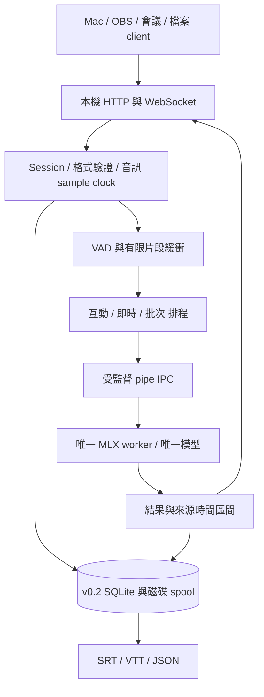

# 03｜架構與技術決策

> 本文件為待實作設計。協定細節以 [04](04-api.md) 為準。

## 技術棧

| 層 | 決策 | 原因／邊界 |
|---|---|---|
| 語言與套件 | arm64 Python 3.12、uv、pyproject.toml、uv.lock | 與模型生態一致，一套 server 語言；鎖定全部依賴 |
| ASR | MLX＋mlx-audio，候選基線 v0.4.5 | 直接適配指定 checkpoint；先通過 P0，才定正式 lock |
| API | FastAPI、Pydantic v2、Uvicorn 單 worker、websockets | HTTP＋WS、型別驗證、可產生 OpenAPI |
| 音訊 | NumPy，標準庫 wave；client 先轉 16kHz mono | 即時 server 不做通用媒體解碼；FFmpeg 留給檔案 client |
| VAD | Silero ONNX、onnxruntime CPU、每 session 獨立 state | 比能量閾值更適合雜訊；只裝 ORT，不為 VAD 引進 Torch |
| 排程 | 自有小型 bounded asyncio scheduler | 單機單模型，無需外部 queue service |
| 推論隔離 | 同一 Python 套件啟動一個受監督子程序 | API 保持回應，卡住可回收整個模型程序 |
| 永久資料 | v0.2 標準庫 sqlite3、WAL、單 writer | 無 DB daemon；短輸入不落盤 |
| 設定／日誌 | TOML、logging JSON event、rotation | 少依賴，避免 log 內容洩漏與無限成長 |
| 測試 | pytest、pytest-asyncio、httpx；Ruff、型別檢查 | mock 驗證契約；Apple Silicon 跑真模型 |
| 發行 | v0.x uv 安裝；v1 評估簽章 runtime bundle | 先可重現，再做使用者免 Python 安裝 |

Silero 的官方文件明確允許只用 ONNX Runtime，但 I/O 與 wrapper 必須自行適配。本案需固定 ONNX 資產 revision/hash，為每個 session 保存獨立 recurrent state，不能直接呼叫會引入 Torch 的套件入口。[Silero 官方說明](https://github.com/snakers4/silero-vad)

## ADR：為何不是第一天就全 Rust 或全 Swift

| 方案 | 評估 | 決定 |
|---|---|---|
| Python API＋Python MLX worker | checkpoint 路徑直接；維護一種 server 語言；runtime 體積較大 | **採用** |
| Rust Axum＋Python MLX worker | 延續原案；HTTP 層更小，但仍要 Python 與 IPC，兩套發行流程 | 未證實 API 是瓶頸前不引進 |
| Swift＋MLX Swift | native bundle 有吸引力；指定混合量化、tokenizer 與 ASR 輸出需另驗證 | 保留後續 backend spike，不阻擋 MVP |
| Rust＋GGUF C++ 引擎 | 可另做 CPU／其他硬體方向，但改變本次 checkpoint 與推論後端 | 不在本期 |

這是縮小實作與運維成本的選擇，不宣稱 Python RAM 比 Rust 少。若 P0 發現依賴／記憶體不符合產品門檻，提出 Swift backend 實測比較，再做 ADR；不要先寫雙語言框架。

## 程序與資料流

API 主程序不 import MLX／模型；worker 使用 spawn/subprocess 啟動，不在已初始化 Metal 後 fork。worker 的同一執行路徑依序 load、warmup、generate、synchronize、shutdown。Uvicorn 只啟一個 worker，production 不開 reload；否則可能意外載入多份模型。

模型 worker 只處理一個 inference task，不自行維護第二條無上限 queue。主程序保管排程與音訊。worker 失敗不連帶殺死 API，readiness 轉為 recovering。

### IPC v1

由 supervisor 唯一讀寫子程序 pipe。request 格式：4-byte big-endian JSON header 長度、UTF-8 JSON header、header 指定長度的 raw PCM。header 含 `ipc_version`、`request_id`、`pcm_bytes`、`sample_rate`、`language`、`max_tokens`。header 上限 16KiB，PCM 上限 960,000 bytes（30秒）。不用 pickle 或 base64。

response 為 4-byte 長度＋JSON，最多 1MiB，含 request ID、worker generation、status、text／error、inference_ms、token 使用量。stdout 專供協定，所有第三方 log／progress 導到 stderr；啟動有 ready 握手。讀寫必須 read-exactly，支援短讀與 timeout。主程序的 async pipe I/O 不阻塞 event loop。

一般取消只丟棄結果，不假裝能中斷 Metal kernel；該 task 完成前 worker 仍忙。超過 task hard timeout 才 terminate，5 秒未退出再 kill，確認退出後才重啟，禁止新舊模型重疊。初始 hard timeout 30 秒／片段，P0 依性能調整；載入 timeout 獨立設為 120 秒。

重啟採1/2/4秒退避，60秒內最多3次；超過即failed並對等待工作發明確錯誤，直到使用者重啟服務。模型不相容／缺資產屬不可重試，不進重啟迴圈。

### 模型相容層

`TeaMlxBackend` 只支援明確 model ID＋revision＋mlx-audio 版本組合。P0 先將 snapshot 下載到固定 cache，驗證 manifest，再以本機 path 與 `strict=True` 載入。

對 v0.4.5 的 audio tower predicate 採模型卡建議的局部 override：只在 dedicated worker、載入這個 checkpoint 的 try/finally 範圍內改 class predicate，finally 還原。檢查 quantization overrides、8-bit tower、4-bit decoder 与 keys/shapes；不能只看到 `load_model` 無例外就視作成功。若 loader 路徑不符合預期，明確報 `model_incompatible`，不忽略缺權重或隨機初始化。相關依據見 [02](02-research.md)。

第一版固定 `language="Chinese"`、`temperature=0`、`batch_size=1`；`max_tokens` 初始 512、上限 1024。碰到 token 上限標記 `possibly_truncated`，不能當完整轉錄。熱詞先只保留 adapter 能力欄位，未完成 system_prompt 驗證前拒絕請求。ITN／替換留給 client；raw text 不被全域字典改寫。

upstream會為短於1秒音訊補零。公開sample範圍、audio_ms與RTF分母都使用原始有效樣本數；若記錄model_input_ms則另列padding後長度。不要直接轉貼upstream segment.end當來源終點。

後端介面保持小型：`load()`、`transcribe(AudioSegment, DecodeOptions)`、`capabilities()`、`close()`。Domain 結果不可洩漏 MLX array 或 upstream 結構。v0.1 不設動態 plugin loader。

## 音訊與端點

HTTP／WS 即時入口只接受 16,000Hz、mono、signed 16-bit little-endian PCM。float32 轉換用 `/32768.0`。不信任 request 宣告後仍當 16kHz；格式不符直接拒絕。client 用可靠 resampler（Mac 可用 AVAudioConverter），不可沿用無抗混疊保證的簡單線性降採樣作為品質基準。

WS 每 frame 建議 20–100ms，最大 200ms＝6,400 PCM bytes；VAD adapter 另緩衝至其 ONNX 模型所需 frame size，不要求網路 frame 對齊 VAD frame。來源 sample 計數永遠包括靜音；不能把去靜音後索引當原時間軸。

| profile | 切段方式 | 初始參數（待 P0/P2 校準） |
|---|---|---|
| utterance | client `commit`／`stop` | 最多30秒；VAD只判斷是否有聲音，不切碎手動句子 |
| continuous | server VAD | 最短語音160ms、句尾靜音500ms、pre-roll**600ms**、最大**12秒**＋2秒grace |
| batch（v0.2） | server 檔案 VAD | 句尾靜音700ms、最大20秒；最大仍不超過30秒 |

無限說話時達 max segment 即 hard split；v0.1 不重疊辨識窗口，以免文字重複，結果帶 `boundary="max_duration"`。切界精度／漏字需納入實測；未通過時調整切點策略，不能靠文字模糊去重把真的重複詞刪掉。**實測後已調整**：達上限先找最近1.2秒內最安靜的window切，找不到就再等2秒grace，切點至少保留目標長度的一半；pre-roll與最大長度的校準依據見 [P2切段報告](benchmarks/p2-segmentation-report.md)。pre-roll 不得跨越已提交的樣本邊界。純靜音不排 GPU；短於 min speech 的明確語音在手動 commit 時保留並標記短片段，不一律丟棄「好」「對」。

## 排程與容量

三個邏輯級別：interactive（utterance）、realtime（continuous）、batch（檔案與恢復 backlog）。不暴露任意 priority 整數給 client。

- scheduler 只在片段邊界換工作；已有 GPU 推論不可搶占。
- 選擇順序：已等待15秒的 realtime 最早者；否則 interactive；否則 realtime；最後 batch。同級 round-robin session、session 內依序。
- interactive 連續執行最多3段，只要 realtime 有候選就先讓1段 realtime。live 活躍時 batch 可暫停，狀態明示 `paused_for_live`，不承諾 batch 同時完成速度。
- P0/P1 預設最多1個 continuous session、4個其他連線。總等待音訊最多60秒、每 session 最多16段；任一上限先到即生效。active receiving buffer 每 session 最多30秒。HTTP 互動超出容量立即429。
- 對 WS 發送 flow-control；忽略暫停仍送超量則顯式 error＋close，不靜默丟音訊。記憶體上限涵蓋 app buffer、WS library queue、IPC 與 outgoing event queue。
- v0.2 durable 音訊可落 spool，但磁碟上限也需強制；不能用落盤假裝無限容量。batch 只預取1段到 RAM。

上限可配置但不能取消。client 的延遲包含「目前不可中斷片段剩餘時間」；若8秒片段推論仍太慢，應縮短片段或減少 admission，不以增加 web workers 解決。

## 狀態、保存與復原

Model state：`unprepared → loading → ready ↔ idle_unloaded`；失敗走 `recovering → ready/failed`。初始 warm 策略為啟動載入、idle 15分鐘後停止 worker 回收 Metal cache；可選 `keep_warm=true`。有活躍 session 或 job 時不卸載。首次請求遇 idle_unloaded 觸發載入，回503 `model_loading`＋retry 提示；不偷偷占著 request 等數分鐘。

v0.1 sessions 與 final 只在 RAM；服務重啟會遺失，斷線不支援 resume。client 必須收到 final 才視為完成。v0.2 durable 接收音訊：先 append spool、flush/fsync，再更新 SQLite persisted cursor；只有兩者成功才 ACK durable watermark。crash 後依 DB cursor 截除多餘尾端；禁止 cursor 指向未落盤資料。

SQLite 表最少：`jobs`、`sessions`、`audio_chunks`、`segments`、`events`。final segment 與對應 event 在同一交易提交。unique(session_id, segment_index) 防止恢復重算造成重複 final；event_id 是每 session 單調序號。in-flight crash 可重算，公開 final 不得重複提交。磁碟 writer 使用專用執行緒，fsync 不阻塞 API。

durable切段時先持久化segment ID、index、範圍、boundary，再發布queued。恢復優先重用已記錄的非終局segment；未封口音訊從最後封口邊界重跑VAD，必要的pre-roll可讀但不得再提交已封口樣本。從已存音訊重建VAD state，不能把丟失的RAM state當成已保存。直到重建到persisted sample才重新grant新音訊窗口；對已發final的範圍永不重新編號或改寫。

預設 ephemeral 不寫 DB 原文；durable 才保存。磁碟資料放 `~/Library/Application Support/TEA ASR/`，cache 指向標準 Hugging Face cache，logs 放 `~/Library/Logs/TEA ASR/`。raw spool 完成後24小時清除，逐字稿7天；active task 不被清除。預設配額10GiB、剩餘空間低於2GiB停止新增持久化音訊並回 `storage_full`。提供明確 delete，export 檔案在使用者指定位置，不受 server TTL 自動刪除。

v0.2 斷線 session 保留10分鐘可 resume；超過期限 flush 已持久化音訊，轉為 completed/interrupted，原始內容依 TTL 保存。重启將 batch running 改為 queued；live session 標記 interrupted，透過 resume 指定恢復，不能自動假裝收音持續。

## 本機服務與發行

只 bind `127.0.0.1:8327`。即使是 localhost，仍使用隨機256-bit bearer token，設定檔權限0600；驗證 Host 與 WS Origin，預設不開 CORS。native client 可無 Origin；若有 Origin 只允許明確 allowlist。v0.1 不支援瀏覽器 token query parameter、token 放 URL 或廣泛 `*` origin。OBS browser overlay 由 bridge 提供呈現，不直接暴露 server 管理 token。

HTTP 健康探針只回最小狀態；其餘需授權。log 不包含 bearer、PCM、prompt、逐字稿或任意使用者檔案路徑。關閉預設 telemetry，模型 prepare 才連外取得固定資產。

v0.2 LaunchAgent 用目前使用者登入工作階段、絕對 executable 路徑、固定 config 路徑，不依賴 shell PATH。`service install/uninstall/status` 保持冪等，不提權、不建立 system daemon。退出時停止 admission，最多30秒 drain，持久化狀態並清理子程序。使用 lock file＋port 檢查避免手動與 agent 啟動兩份服務。睡眠喚醒後先檢查 worker health；client 開新 session 或 durable resume，時間軸缺口必須明示。

v1 的使用者版可包成簽章／公證的 macOS app 或 installer，附 arm64 Python runtime、套件、ONNX 資產與 CLI，模型獨立下載。需實測 Metal library 路徑、clean-machine 啟動、更新回滾與卸載；不承諾靠單檔 PyInstaller 就解決。不建 Electron 管理 UI；必要時補 Swift 選單列外殼。

## 後續能力

`Translator`、`Aligner`、`Diarizer` 僅定義資料邊界，v0.1 不實作空框架。翻譯保留 source segment ID、source text、target language 與 provider revision；失敗不影響原稿。精準 alignment 成功前 SRT 僅使用 segment 时间，標 `timestamp_quality="segment"`，不可產生假 word confidence。

串流上下文修訂已列為P2a正式階段，完整流程見 [07](07-contextual-streaming.md)。在上述final-only核心之外新增preview task、最新快照合併、修訂版本與端點grace。preview排在所有等待final之後、batch之前，共用同一worker；revisable continuous採900ms總靜音與8秒上限。P0先量測累積重辨識總成本，不能把token輸出stream包裝成原生online ASR。

P2a同片段後文修訂不需要prompt。可選前文context獨立驗證，只有通過後才把context_biasing設true；限制範圍、凍結版本與資料隔離依07。final仍不可改寫；較後的全篇校訂屬獨立document revision。
