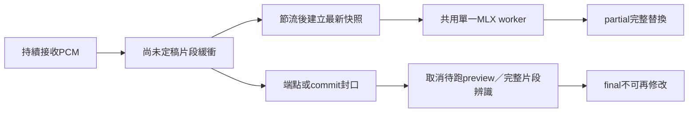

# 07｜串流預覽與上下文修訂

> 新增需求：呈現類似系統語音輸入的「邊說、邊出字、隨後文修正」。本文件為設計，尚未實測；不推定Apple內部使用何種模型或演算法。

## 預期體驗

同一段話逐漸累積音訊，畫面可能經歷：

```text
暫定：我們需要權限
修訂：我們需要全線
定稿：我們需要全線停駛，才能進行維修。
```

這是示意，不是模型實測。重點是後面的「停駛、維修」能提供消歧線索；client替換同一段暫定文字，而不是把每次結果追加成三句。

**產品決策：納入核心路線，新增P2a／v0.1.1，緊接P2之後。** v0.1保留final-only作為最小可用版與降級路徑；P0就先量測重辨識成本，不等到做client才發現速度不夠。詳細wire契約見 [04](04-api.md)。

## 三種能力分開處理

| 能力 | 本案方式 | 第一階段 |
|---|---|---|
| 後文修正前面的辨識 | 對同一個尚未定稿片段，用累積音訊重辨識，整段更新 | **P2a必要** |
| 前文／專有詞輔助辨識 | 使用已確認文字作有限context提示；需验证system_prompt效果 | P2a實驗，独立capability，預設關閉 |
| 語句潤飾、語意重寫 | 另行文字校對或LLM，保留逐字稿並提供版本 | 後續opt-in，不是即時ASR必要依賴 |

第一種方式讓ASR在每次推論時同時看到該片段較早與較晚的聲音；不需要先常駐第二個LLM。更正品質仍需實測，不能承諾後文一定會修正正確。句子一旦final，後續聲音不再自動回改該句。

所選mlx-audio固定版本的 `generate` 接受完整音訊，`stream_transcribe` 主要是輸出token串流；P2a在服務層做累積音訊重辨識，`native_audio_streaming`仍為false。未證實可安全沿用變動音訊的KV cache，不自行沿用以求速度。[固定版Qwen3 ASR實作](https://github.com/Blaizzy/mlx-audio/blob/04151c6abb74b886f879a4457ccdc96761f10102/mlx_audio/stt/models/qwen3_asr/qwen3_asr.py)

Apple Speech提供中間結果開關；這支持中間稿／終稿的介面區分，不能據此推論系統聽寫的內部校對流程。[shouldReportPartialResults](https://developer.apple.com/documentation/speech/sfspeechrecognitionrequest/shouldreportpartialresults)

## 可修訂的文字單位

每段文字有固定 `segment_id` 與 `segment_index`，從第一次預覽到final都不改ID。`revision`單調增加；每次partial包含**完整替換文字**，不用token append或字元位置patch。如此避免繁體字、emoji、UTF-16與grapheme offset跨client不一致。

只有兩種權威程度：

- **partial：** 整段仍可改寫、縮短或清空；可供顯示，不可視為正式文件或已輸入文字。
- **final：** 這個segment不再變更；才可正式貼入、匯出或觸發翻譯。

P2a不另宣告「永久穩定前綴」。連續兩次相同不表示下一個詞不會推翻它；穩定度可以後續作為視覺提示，但不能變成提前貼入的授權。

暫定文字的時間區間是本次讀入的音訊範圍；partial的end_sample隨音訊成長，不代表每個字都有時間戳。final仍使用server保存的有效樣本區間，排除模型padding。

## 累積重辨識流程



1. 首次偵測語音就分配segment ID/index，狀態為open。utterance在第一個非空音訊frame分配；若最後是無聲，仍以skipped結束該ID。
2. 累積至少800ms新語音後，允許第一次preview。初始更新間隔800ms；這是候選參數，不是延遲承諾。
3. 快照涵蓋片段起點到最新已接收sample，包含pre-roll與中間停頓。每次固定其audio end與context revision；新聲音繼續收進原buffer。
4. 一個session最多一個執行中preview與一個待跑preview；後者永遠由較新快照替換。全機執行中preview最多一個，不新增模型副本。
5. 完成的preview若segment仍open、比上一次發布的audio end更新且context版本仍有效，可以發布。收音期間有更新的frame不會使它自動作廢，否則連續說話將永遠看不到preview。落後最新收音超過2秒則丟棄，等下一次快照。
6. 到端點／commit／stop後封口：移除待跑preview，執行中的preview結果不再發布；完整片段final task進正式排程。final後禁止任何晚到preview覆蓋。
7. final失敗回segment.error並清除暫定狀態；不能把最近partial偷偷升格成final。可讓client保留明示「未確認」的文字供手動複製。

內部task加 `kind=preview|final`、segment ID、audio end、context revision與generation。IPC把這些欄位帶回supervisor；公開revision在發布事件時分配，不拿模型token counter當revision。

## 分段、停頓與後文範圍

final-only維持03既有端點設定。啟用revisable時採以下獨立設定，server在session.started回報有效值：

| profile | 可修訂範圍 | 封口條件 |
|---|---|---|
| continuous＋revisable | 目前尚未封口的一段，最多8秒 | 500ms靜音為候選端點，再等400ms音訊時間；期間恢復語音則取消候選端點。900ms連續靜音、8秒上限或stop即封口 |
| utterance＋revisable | 手動片段最多30秒 | commit／stop；前8秒可preview，超過8秒暫停preview直到final，不截掉前8秒改辨識尾端 |

硬上限以有效累積音訊長度計，包括停頓與pre-roll。初期不跨已final片段做重疊音訊重辨識，也不從整段辨識結果中猜哪些字屬於前段。短停頓合併只發生在**封口前**，不牽涉retract已final文字。

900ms是聲音sample clock的靜音長度，不是伺服器收到frame後的wall-clock等待。client仍需傳送靜音frame；停止送資料不代表語句已講完。stop立刻封口，省略grace，但仍等final推論完成。

8秒之後的新後文不能修正前段，是輕量方案的明確界線。若實測顯示需要較長上下文，先評估8→12秒的效能與品質，再調整capability limit。字幕／會議的「跨句全篇校訂」是另外的文件版本作業，不重用transcript.final來覆寫歷史。

## 輕量化與排程

preview在所有等待中的final之後執行、batch之前；不改既有final公平性規則。final已等待時不啟動新preview。執行中的preview不能安全搶占，其耗時也計入final等待上限。

- 動態間隔 `max(800ms, 最近preview推論耗時×3)`，以完成時間為下一次排程起點；沒有新增音訊或文字沒變就不發無意義更新。
- 另設全機preview GPU佔用目標：最近10秒最多3秒推論耗時。根據近期耗時預估先做admission；超支後停preview，不能把這個soft budget說成可中止kernel的硬限制。
- active buffer與快照副本都計入03記憶體上限；open段最多8秒可preview，不對整場會議越累積越長地重跑。
- worker壓力、final排隊、預覽過慢時降低頻率或暫停，發 `preview.status`。音訊仍持續接收，已accept的正式工作不能因preview被丟棄。
- preview失敗不自動重啟健康worker，不建立重試風暴；真worker crash仍走03 supervisor規則。停preview不代表停錄音。

P0 benchmark必須包括「0.8秒、1.6秒……8秒多次重跑＋最後final」的**總推論成本／原始8秒**。單次8秒音訊RTF很低，不代表這個模式足夠即時。若8秒preview task的p95超過700ms，先限制可preview長度或暫停較長片段預覽，測得合格前不預設開啟。單一模型若無法達到需求，再提出真增量ASR後端比較，不能僅重命名stream選項。

## 前文文字context：獨立實驗

P2a基本路徑不依赖文字prompt；同片段音訊本身已提供前後文。前文提示待驗證後才啟用 `context_biasing=true`：

1. 來源僅同session最近兩段已final文字，合計最多256個模型token；可選session.start提供的最多32個hotwords、每詞最多32 Unicode code points。合併prompt最多384個模型token。
2. 不把partial餵回下一輪prompt，避免自我強化錯誤；不自動讀取其他app、剪貼簿或其他session的內容。
3. context在segment打開時凍結，該段所有preview/final使用同一版本；前段稍後final則只供下一新段使用，避免同一段因prompt變動而抖動。
4. adapter驗證 `system_prompt` 接法，明示前文僅供詞彙參考、只轉錄目前聲音。model card其他backend的 `context=` 不能直接照搬。
5. 對照測試：同音專有詞是否改善、是否抄出前文、數字或否定詞是否遭改寫、錯誤context是否放大偏誤。未通過時保持capability=false。

P2a實验介面用session.start的 `context` 物件（04定義），連線中不可更新；後續若需要使用者修正字典或清空topic，先開新session。不同會議／來源切換必須清空歷史，不做跨session「記憶」。

## 四種client的更新行為

| Client | partial怎麼顯示 | final怎麼處理 |
|---|---|---|
| 選單列聽寫工具 | 自有浮動視窗整段替換；不改目標app文件 | 貼入一次；若焦點／輸入目標改變則留在預覽，等待使用者選擇 |
| 真正Mac輸入法 | 只更新自己持有的marked text／組字區 | 結束組字並commit一次；不回刪既有文件 |
| OBS | 替換當前cue，節流250ms且合併新revision；不要讓字幕行持續跳動 | 鎖定該cue，再移至下一段 |
| 會議／字幕編輯器 | 同segment row替換，標「辨識中」 | 保存逐字稿；人工編輯後另開document revision，禁止ASR覆蓋使用者編輯 |

AppKit的marked-text介面支持替換指定組字範圍，但一般選單列app不能因此任意操控其他app的text client。P5b需要實作InputMethodKit輸入法整合與相容性測試；不拿Accessibility＋連續退格假裝組字。[setMarkedText](https://developer.apple.com/documentation/appkit/nstextinputclient/setmarkedtext(_:selectedrange:replacementrange:))

P5a先完成浮動預覽；P5b才交付直接在游標處更新的IME體驗。須測原生TextEdit、瀏覽器輸入框、常用通訊app、既有中文組字、焦點切換、使用者移動游標／編輯、安全輸入與取消。失去組字所有權後不再替換；不要把未確認文字送進下一個焦點視窗。

## 保存與斷線

P2a ephemeral斷線即清除partial，不承諾恢復。P4 durable整合時：final與事件仍同交易保存；partial文字不寫一般log、不作durable transcript、不重播舊partial。已分配segment ID/index與revision high-water mark需持久化，防止重啟後revision倒退。resume成功後client先清除所有未final預覽，server由persisted音訊重建並發布更高revision快照。

若segment已有final，resume只重播final，永遠不重建它的partial。replay可能重複final，client按segment ID去重；人工文件修改則由client自己的文件版本管理，不與ASR revision混用。

## 驗收與交付

除05既有測試外，新增：

- 用固定corpus逐時送音訊，保存每個partial的發布時刻、audio end、revision與最後答案；不能只測整段一次辨識。
- 至少30組後文消歧、20組數字／否定詞／專有名詞、20組中英混用，含後文推翻早期猜測與真的重複詞。比較first partial、last partial、final對人工答案的錯誤率。
- 分別報告「錯改對」「對改錯」率、每秒文字改動量、首次可見延遲、final lag、總RTF與電力／memory變化；用相同音訊做final-only對照。
- 初始UX目標：首次可見p95≤1.5秒（自語音起點）、更新間隔p95≤1.5秒（正常負載）、end-of-speech-to-final p95≤2.5秒（含900ms靜音）、final MER不比final-only退步超過1個百分點。目標未實測，若後端不符就調整設計並揭露，不改寫數據。
- 假worker確定性測試：partial替換而非append、清空文字、revision跳號／舊revision、final後遲到partial、cancel、preview失敗、stop、跨segment隔離、grace期間恢復說話、8秒hard split、30秒utterance與省略preview。
- 混合負載：一場會議revisable＋偶發語音輸入＋batch，final延遲不因preview持續惡化；超載能顯示preview暫停而不停收音。
- P5b驗收必須由真實app互動測試，不以server JSON測試取代。尚未完成時產品只宣稱「浮動預覽修訂」。

交付 `docs/benchmarks/p2a-report.md`、可重跑replay benchmark、07與04的contract測試及一個能原位替換segment的reference client。這是正式里程碑，不再只是未排期的preview想法。

## 校準後的調整（2026-09-19）

`max_preview_audio_ms` 由 8000 改為 **15000**。原本的 8 秒上限是為了限制預覽成本，
但 continuous 片段在切段校準後可長到 14 秒（12 秒上限＋2 秒 grace），
於是長句講到一半預覽就凍住，使用者看到的是「字停住了但我還在講」。
實測 RTF 約 0.03，15 秒的預覽推論不到半秒，而且預覽排在最低優先序，
不會排擠正式片段。依據見 [P2 切段報告](benchmarks/p2-segmentation-report.md)
與 [P2a 預覽報告](benchmarks/p2a-preview-report.md)。
