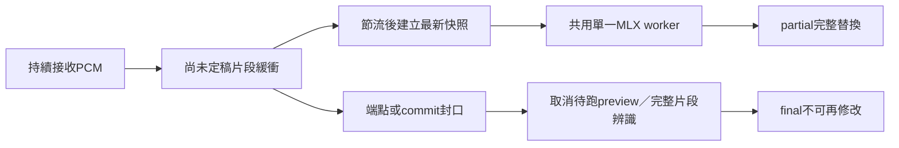

# 07｜串流預覽與上下文修訂

> 新增需求：呈現類似系統語音輸入的「邊說、邊出字、隨後文修正」。本文件為設計，尚未實測；不推定Apple內部使用何種模型或演算法。

## 預期體驗

同一段話逐漸累積音訊，畫面可能經歷：

```text
暫定：我們需要權限
修訂：我們需要全線
定稿：我們需要全線停駛，才能進行維修。
```

這是示意，不是模型實測。重點是後面的「停駛、維修」能提供消歧線索；client替換同一段暫定文字，而不是把每次結果追加成三句。

**產品決策：納入核心路線，新增P2a／v0.1.1，緊接P2之後。** v0.1保留final-only作為最小可用版與降級路徑；P0就先量測重辨識成本，不等到做client才發現速度不夠。詳細wire契約見 [04](04-api.md)。

## 三種能力分開處理

| 能力 | 本案方式 | 第一階段 |
|---|---|---|
| 後文修正前面的辨識 | 對同一個尚未定稿片段，用累積音訊重辨識，整段更新 | **P2a必要** |
| 前文／專有詞輔助辨識 | 確定性 replacement 優先；domain/hotword model prompt 獨立開關 | replacement 可用；prompt experimental 且預設關閉 |
| 語句潤飾、語意重寫 | 另行文字校對或LLM，保留逐字稿並提供版本 | 後續opt-in，不是即時ASR必要依賴 |

第一種方式讓ASR在每次推論時同時看到該片段較早與較晚的聲音；不需要先常駐第二個LLM。更正品質仍需實測，不能承諾後文一定會修正正確。句子一旦final，後續聲音不再自動回改該句。

所選mlx-audio固定版本的 `generate` 接受完整音訊，`stream_transcribe` 主要是輸出token串流；P2a在服務層做累積音訊重辨識，`native_audio_streaming`仍為false。未證實可安全沿用變動音訊的KV cache，不自行沿用以求速度。[固定版Qwen3 ASR實作](https://github.com/Blaizzy/mlx-audio/blob/04151c6abb74b886f879a4457ccdc96761f10102/mlx_audio/stt/models/qwen3_asr/qwen3_asr.py)

Apple Speech提供中間結果開關；這支持中間稿／終稿的介面區分，不能據此推論系統聽寫的內部校對流程。[shouldReportPartialResults](https://developer.apple.com/documentation/speech/sfspeechrecognitionrequest/shouldreportpartialresults)

## 前一段尾音補句首（final-only carry，2026-10-03）

speakers 語料中有數段模型只回出 segment 後半句的案例；同一音訊多給前後文的離線解碼曾找回漏掉的句首，但也帶入鄰段文字。因此只在 final 解碼時，把目前 segment 起點前最多 `carry_context_s` 秒送入模型，再從新文字開頭去掉屬於前一 final 的尾端重疊。segment sample 時間與 `audio_ms` 維持原切段範圍。

設定在 `[service]`：`carry_context_s` 範圍 0–5 秒、預設 **0（關閉）**；`carry_context_max_gap_s` 範圍 0–30 秒、預設 **1.5**。環境變數分別為 `TEA_ASR_CARRY_CONTEXT_S` 與 `TEA_ASR_CARRY_CONTEXT_MAX_GAP_S`。只有緊接的前一段有成功 final，且從該段 `end_sample` 到新段 `start_sample` 的間隔不超過 max gap，才帶音訊及文字上下文。答案集相鄰項目間隔統計：speakers 39 個轉段中 35 個在 1.5 秒內、39 個在 5 秒內；music-8900 的 20 個轉段中 15 個在 1.5 秒內、18 個在 5 秒內。這只量到答案項目的時間間隔，不代表 live segmenter 的分布。

去重使用共用的 `strip_carried_overlap()`：NFKC 寬度折疊與 casefold 後忽略標點／空白，對前一 final 的尾端與新辨識開頭做有界編輯距離比對，至少 4 個正規化字元，最多約每 4 字 1 個編輯差異。移除時用來源索引切原始文字，保留新句拼法及標點。成功去重只修改 final `text`，加 `carry_overlap_stripped`；找不到可信重疊或只剩空白時，改用 segment 音訊重跑一次，並加 `carry_overlap_uncertain`。這時重跑 segment-only 會沿用原辨識路徑，降低把鄰段內容重複顯示的風險；重跑比單次 segment 辨識多一次推論成本，重疊成立時成本是額外 L 秒左音訊。

只讓 final 使用 carry。preview 每次重辨識都加 L 秒會把額外成本乘上預覽次數；preview 仍只代表自己的 segment，stable 仍從這些 preview 衍生，final 收尾照既有 tracker 規則維持 append-only。真實模型 CER／bootstrap CI 與 duplication count 由本機 `.soak/gold/run-carry-eval.sh` 對 speakers、music-8900 測量。在這些結果通過 docs/06 的品質門檻前，`carry_context_s` 維持預設 0。

## 可修訂的文字單位

每段文字有固定 `segment_id` 與 `segment_index`，從第一次預覽到final都不改ID。`revision`單調增加；每次partial包含**完整替換文字**，不用token append或字元位置patch。如此避免繁體字、emoji、UTF-16與grapheme offset跨client不一致。

只有兩種權威程度：

- **partial：** 整段仍可改寫、縮短或清空；可供顯示，不可視為正式文件或已輸入文字。
- **final：** 這個segment不再變更；才可正式貼入、匯出或觸發翻譯。

P2a不另宣告「永久穩定前綴」。連續兩次相同不表示下一個詞不會推翻它；穩定度可以後續作為視覺提示，但不能變成提前貼入的授權。（2026-09-24 起另有opt-in的字幕用穩定流，見文末「只增不改的穩定前綴」；它仍不是貼入授權，partial／final語意不變。）

暫定文字的時間區間是本次讀入的音訊範圍；partial的end_sample隨音訊成長，不代表每個字都有時間戳。final仍使用server保存的有效樣本區間，排除模型padding。

## 累積重辨識流程


```mermaid
flowchart LR
  A[持續接收PCM] --> B[尚未定稿片段緩衝]
  B --> C[節流後建立最新快照]
  C --> D[共用單一MLX worker]
  D --> E[partial完整替換]
  B --> F[端點或commit封口]
  F --> G[取消待跑preview／完整片段辨識]
  G --> H[final不可再修改]
```

1. 首次偵測語音就分配segment ID/index，狀態為open。utterance在第一個非空音訊frame分配；若最後是無聲，仍以skipped結束該ID。
2. 累積至少 `preview_min_audio_ms` 新語音後允許下一次preview，間隔下限 `preview_min_interval_ms`。原候選值800ms／800ms，2026-09-27 依量測改為300ms／300ms（見本文「預覽節奏調整」）；這是server設定，不是延遲承諾。
3. 快照涵蓋片段起點到最新已接收sample，包含pre-roll與中間停頓。每次固定其audio end與context revision；新聲音繼續收進原buffer。
4. 一個session最多一個執行中preview與一個待跑preview；後者永遠由較新快照替換。全機執行中preview最多一個，不新增模型副本。
5. 完成的preview若segment仍open、比上一次發布的audio end更新且context版本仍有效，可以發布。收音期間有更新的frame不會使它自動作廢，否則連續說話將永遠看不到preview。落後最新收音超過2秒則丟棄，等下一次快照。
6. 到端點／commit／stop後封口：移除待跑preview，執行中的preview結果不再發布；完整片段final task進正式排程。final後禁止任何晚到preview覆蓋。
7. final失敗回segment.error並清除暫定狀態；不能把最近partial偷偷升格成final。可讓client保留明示「未確認」的文字供手動複製。

內部task加 `kind=preview|final`、segment ID、audio end、context revision與generation。IPC把這些欄位帶回supervisor；公開revision在發布事件時分配，不拿模型token counter當revision。

## 分段、停頓與後文範圍

final-only維持03既有端點設定。啟用revisable時採以下獨立設定，server在session.started回報有效值：

| profile | 可修訂範圍 | 封口條件 |
|---|---|---|
| continuous＋revisable | 目前尚未封口的一段，最多8秒 | 500ms靜音為候選端點，再等400ms音訊時間；期間恢復語音則取消候選端點。900ms連續靜音、8秒上限或stop即封口 |
| utterance＋revisable | 手動片段最多30秒 | commit／stop；前8秒可preview，超過8秒暫停preview直到final，不截掉前8秒改辨識尾端 |

硬上限以有效累積音訊長度計，包括停頓與pre-roll。初期不跨已final片段做重疊音訊重辨識，也不從整段辨識結果中猜哪些字屬於前段。短停頓合併只發生在**封口前**，不牽涉retract已final文字。

900ms是聲音sample clock的靜音長度，不是伺服器收到frame後的wall-clock等待。client仍需傳送靜音frame；停止送資料不代表語句已講完。stop立刻封口，省略grace，但仍等final推論完成。

8秒之後的新後文不能修正前段，是輕量方案的明確界線。若實測顯示需要較長上下文，先評估8→12秒的效能與品質，再調整capability limit。字幕／會議的「跨句全篇校訂」是另外的文件版本作業，不重用transcript.final來覆寫歷史。

## 輕量化與排程

preview在所有等待中的final之後執行、batch之前；不改既有final公平性規則。final已等待時不啟動新preview。執行中的preview不能安全搶占，其耗時也計入final等待上限。

- 動態間隔 `max(preview_min_interval_ms, 最近preview推論耗時×preview_load_factor)`，從上一次preview**開始**起算（factor=k時單一session的預覽最多占worker 1/k）；原提案為 `max(800ms, 耗時×3)` 且從完成時間起算，實作與量測見「預覽節奏調整」。沒有新增音訊就不排preview。
- 另設全機preview GPU佔用目標：最近10秒最多3秒推論耗時。根據近期耗時預估先做admission；超支後停preview，不能把這個soft budget說成可中止kernel的硬限制。
- active buffer與快照副本都計入03記憶體上限；open段最多8秒可preview，不對整場會議越累積越長地重跑。
- worker壓力、final排隊、預覽過慢時降低頻率或暫停，發 `preview.status`。音訊仍持續接收，已accept的正式工作不能因preview被丟棄。
- preview失敗不自動重啟健康worker，不建立重試風暴；真worker crash仍走03 supervisor規則。停preview不代表停錄音。

P0 benchmark必須包括「0.8秒、1.6秒……8秒多次重跑＋最後final」的**總推論成本／原始8秒**。單次8秒音訊RTF很低，不代表這個模式足夠即時。若8秒preview task的p95超過700ms，先限制可preview長度或暫停較長片段預覽，測得合格前不預設開啟。單一模型若無法達到需求，再提出真增量ASR後端比較，不能僅重命名stream選項。

## Recognition context：model prompt experimental，預設關閉

服務支援每個 session 的 domain、hotwords、server dictionary 與 replacement table。`TEA_ASR_CONTEXT_HINTS=1` 才會宣告 `capabilities.features.context_biasing=true`，並啟用 profiles 與 deterministic replacements；預設關閉。審閱過的 replacement 是建議工具。model prompt 由獨立的 `TEA_ASR_CONTEXT_PROMPT=1` 開啟，且需先啟用 context hints；prompt 預設關閉。prompt 關閉時 domain/hotwords 仍驗證與回報，但不會進模型 request。`session.started.context.prompt_applied` 說明該 session 是否送出 prompt；`session.started.context` 永遠不含 `prompt_tokens`，因為 prompt 逐 request 組裝，token 數會寫入 server log。

**2026-09-28 真實音訊 smoke finding：** coordinator 用4段真實講道音訊比較了 prompt on/off。Prompt 約增加150個 prompt tokens，整體沒有改善：一段原本正確的「聖經」變成「聖家」，另一段失去標點；「住棚節」的三種常見誤聽「祝棚節」、「祝鵬節」、「祝鵬傑」也沒有被 prompt 修正。故 model prompt 保持 experimental 並預設關閉；對確認過的固定誤聽，建議用 deterministic replacement。這是小樣本觀察，不代表完整 CER 評估。

- prompt 來源只包含這次 session 的 domain 和 hotwords；不使用前幾段 final，也不讀其他 app、剪貼簿或其他 session。`use_previous_finals` 已從舊草圖移除，延後到有獨立評估後再做。
- **每個 segment 開啟時凍結** prompt 和 replacement 規則。該 segment 的全部 preview/final 沿用快照，後續 session 或檔案變更只影響下一個 session。
- 本機鎖定的 mlx-audio 0.4.5 Qwen3-ASR 程式中，`generate()` 接受 `system_prompt`（`qwen3_asr.py:1199–1248`），`_build_prompt()` 把它作為純文字放在 system turn（`:911–945`）。server 以該模型 tokenizer 將 context prompt 限為384 tokens。只有 `TEA_ASR_CONTEXT_PROMPT=1` 時才傳送 domain/hotwords；關閉時不向 model request 加入欄位，與無 context 的 request byte-identical。`session.started.context.prompt_applied` 回報實際狀態；`session.started.context` 不含 prompt token count，backend 回報的逐 request token 數只記在 `stream.context_prompt_tokens` INFO log。替換表獨立於 prompt。
- PUA filter 與 repetition trim 之後才套 replacement，stable tracking 之前。替換依原始辨識字串由左至右執行，最長命中優先且不重疊；不遞迴處理替換結果，`raw_text` 不變。
- replacement 若落在已提交 stable 字尾或跨過提交邊界，stable 永遠不回刪既有文字：preview 不會發布與已提交前綴衝突的更新；finalizer 保留原 committed prefix，依對齊結果追加 final 的尾段。stable 可能呈現舊前綴和修正後尾段組成的文字，final 則保留完整替換結果。
- final 若含 domain 文字中至少12個連續原字，加入 `context_echo` 警告，不移除 transcript。它只能偵測文字重疊，無法確認音訊是否真的說了這些字，因此可能誤報。
- CER 驗收必須檢查聖經同音詞、prompt echo、替換誤傷、數字、否定詞與錯誤 context 放大偏誤。數字和否定詞沒有特殊保護。未完成評估前不要把預設改為開啟。

Source inspected in the locked environment: [mlx-audio Qwen3-ASR implementation](https://github.com/Blaizzy/mlx-audio/blob/04151c6abb74b886f879a4457ccdc96761f10102/mlx_audio/stt/models/qwen3_asr/qwen3_asr.py), also present under the service venv's `site-packages/mlx_audio/stt/models/qwen3_asr/qwen3_asr.py`.

## 四種client的更新行為

| Client | partial怎麼顯示 | final怎麼處理 |
|---|---|---|
| 選單列聽寫工具 | 自有浮動視窗整段替換；不改目標app文件 | 貼入一次；若焦點／輸入目標改變則留在預覽，等待使用者選擇 |
| 真正Mac輸入法 | 只更新自己持有的marked text／組字區 | 結束組字並commit一次；不回刪既有文件 |
| OBS | 替換當前cue，節流250ms且合併新revision；不要讓字幕行持續跳動 | 鎖定該cue，再移至下一段 |
| 會議／字幕編輯器 | 同segment row替換，標「辨識中」 | 保存逐字稿；人工編輯後另開document revision，禁止ASR覆蓋使用者編輯 |

AppKit的marked-text介面支持替換指定組字範圍，但一般選單列app不能因此任意操控其他app的text client。P5b需要實作InputMethodKit輸入法整合與相容性測試；不拿Accessibility＋連續退格假裝組字。[setMarkedText](https://developer.apple.com/documentation/appkit/nstextinputclient/setmarkedtext(_:selectedrange:replacementrange:))

P5a先完成浮動預覽；P5b才交付直接在游標處更新的IME體驗。須測原生TextEdit、瀏覽器輸入框、常用通訊app、既有中文組字、焦點切換、使用者移動游標／編輯、安全輸入與取消。失去組字所有權後不再替換；不要把未確認文字送進下一個焦點視窗。

## 保存與斷線

P2a ephemeral斷線即清除partial，不承諾恢復。P4 durable整合時：final與事件仍同交易保存；partial文字不寫一般log、不作durable transcript、不重播舊partial。已分配segment ID/index與revision high-water mark需持久化，防止重啟後revision倒退。resume成功後client先清除所有未final預覽，server由persisted音訊重建並發布更高revision快照。

若segment已有final，resume只重播final，永遠不重建它的partial。replay可能重複final，client按segment ID去重；人工文件修改則由client自己的文件版本管理，不與ASR revision混用。

## 驗收與交付

除05既有測試外，新增：

- 用固定corpus逐時送音訊，保存每個partial的發布時刻、audio end、revision與最後答案；不能只測整段一次辨識。
- 至少30組後文消歧、20組數字／否定詞／專有名詞、20組中英混用，含後文推翻早期猜測與真的重複詞。比較first partial、last partial、final對人工答案的錯誤率。
- 分別報告「錯改對」「對改錯」率、每秒文字改動量、首次可見延遲、final lag、總RTF與電力／memory變化；用相同音訊做final-only對照。
- 初始UX目標：首次可見p95≤1.5秒（自語音起點）、更新間隔p95≤1.5秒（正常負載）、end-of-speech-to-final p95≤2.5秒（含900ms靜音）、final MER不比final-only退步超過1個百分點。目標未實測，若後端不符就調整設計並揭露，不改寫數據。
- 假worker確定性測試：partial替換而非append、清空文字、revision跳號／舊revision、final後遲到partial、cancel、preview失敗、stop、跨segment隔離、grace期間恢復說話、8秒hard split、30秒utterance與省略preview。
- 混合負載：一場會議revisable＋偶發語音輸入＋batch，final延遲不因preview持續惡化；超載能顯示preview暫停而不停收音。
- P5b驗收必須由真實app互動測試，不以server JSON測試取代。尚未完成時產品只宣稱「浮動預覽修訂」。

交付 `docs/benchmarks/p2a-report.md`、可重跑replay benchmark、07與04的contract測試及一個能原位替換segment的reference client。這是正式里程碑，不再只是未排期的preview想法。

## 校準後的調整（2026-09-19）

`max_preview_audio_ms` 由 8000 改為 **15000**。原本的 8 秒上限是為了限制預覽成本，
但 continuous 片段在切段校準後可長到 14 秒（12 秒上限＋2 秒 grace），
於是長句講到一半預覽就凍住，使用者看到的是「字停住了但我還在講」。
實測 RTF 約 0.03，15 秒的預覽推論不到半秒，而且預覽排在最低優先序，
不會排擠正式片段。依據見 [P2 切段報告](benchmarks/p2-segmentation-report.md)
與 [P2a 預覽報告](benchmarks/p2a-preview-report.md)。

## 預覽節奏調整（2026-09-27）

OBS 字幕在快語速下出字晚、一次跳 4–5 個字；原因是預覽固定 800 ms／800 ms，`transcript.stable` 又要兩版一致。
離線 RTF 約 0.03，worker 大多閒置，所以改為可設定的節奏加負載保護，[量測](benchmarks/preview-cadence-report.md)後預設：

| server 設定（config.toml `[service]`／環境變數） | 預設 | 範圍 |
|---|---|---|
| `preview_min_audio_ms`／`TEA_ASR_PREVIEW_MIN_AUDIO_MS` | 300 | 100–5000 |
| `preview_min_interval_ms`／`TEA_ASR_PREVIEW_MIN_INTERVAL_MS` | 300 | 100–5000 |
| `preview_load_factor`／`TEA_ASR_PREVIEW_LOAD_FACTOR` | 2 | 0–10（0＝關閉保護） |

- 下一次預覽要有 `preview_min_audio_ms` 新音訊，且距上一次預覽開始至少 `max(min_interval, k × 上次解碼時間)`；
  解碼時間是 worker 呼叫的 wall time、不含排隊。間隔未到時以 timer 在門檻打開時重排，不依賴 client 的 frame 大小。
- 每個 session 仍最多一個執行中預覽、一個待跑重排；`max_preview_audio_ms` 不變。節奏是 server 端設定，client 不能要求更快。
- 端點封口時，還在排隊的預覽直接從 scheduler 移除（上面流程第 6 步的「移除待跑preview」），不再排在 final 後面白跑一次；
  已在 worker 上的那一次無法搶占，最多讓 final 多等一次預覽解碼。
- 結果（單 session）：stable 提交延遲中位數 0.87 → 0.10 秒、每次 stable 增字 p95 7 → 4、首字延遲中位數約 180 → 80 ms；
  worker 忙碌 0.16 → 0.27，兩個 session 合計 0.49；final 延遲不變。代價是 partial 改寫已提交文字的比例 20–23% → 26–27%、
  diverged 段 6–8 → 9／25。句首兩字的正確出現時間沒有變快，那是模型收斂速度。

## 只增不改的穩定前綴（opt-in，2026-09-24）

live subtitle 要的是「字出來就不再跳」。partial 做不到：[量測](benchmarks/stable-prefix-report.md)顯示
partial→partial 有 78.8% 會改掉已顯示的字（忽略標點仍 44.7%），95.5% 的句子至少被改過一次。
所以另開一條**衍生**的事件 `transcript.stable`，契約在 [04](04-api.md)「只增不改的穩定字幕流」。

**方法：LocalAgreement-n**（Whisper-Streaming）。每個 segment 各自保留最近 n 版已發布的 partial；
比較時將每個 grapheme cluster 依 NFKC、casefold、再 NFKC 正規化，移除空白與 Unicode 標點，並逐字折疊
`〇零一二三四五六七八九`。不解析「十／百／千」等單位數字，避免推測中文數字的算術意思。n 版比較 key
的共同開頭若比已提交 key 更長，就從最新 partial 的表面文字投影多出的範圍，再正式提交，之後永不更改。
它只讀 client 已經收到的 partial 文字（PUA 已過濾），不另跑推論、不改 partial／final 的欄位、不影響排程。
n 預設 2、可選 3。

**切點與標點規則**（`src/tea_asr/stable.py`）：key 邊界必須能映射回每一版 partial 的完整表面 grapheme，且切點安全——

1. grapheme cluster 邊界：不切開 ZWJ emoji、國旗、keycap、膚色、base＋組合字、韓文字母組合。
   只用標準庫實作 UAX #29 的保守子集：可能拒絕某些合法切點（晚一版提交），但絕不接受 UAX #29 禁止的切點；
   測試以 `regex` 的 `\X` 交叉驗證。因為事件帶完整文字、且新值以舊值開頭，新值的 UTF-8 bytes 也一定以舊值的 bytes 開頭，
   C client 可以直接用 `strlen(舊值)` 取出新增部分，不會切壞多位元組字元。
2. 不切在英數字詞中間（`iPh`／`202` 不提交，等整個詞）；結尾剛好是英數字詞且沒有下一版證明詞已結束時也不提交。
3. key 結尾落在最後一個已同意的文字 grapheme；因此尾端標點與空白不會先被帶入提交範圍。比較 key 內的標點只有在每個投票 hypothesis 都於同一 key 位置含相同 NFKC 標點序列時才會輸出，標點不同或一方沒有時只略過標點、不阻擋後續文字。punctuation restore 仍在 stable 前執行；開啟時沿用其 partial 尾端 2 個非標點字元的 right-context holdback。

**與 final 的關係。** 逐字稿、存檔、匯出、貼入與翻譯一律只認 `transcript.final`（docs/06 約束5）。
穩定流在 final 之後收尾一次：final 的比較 key 延伸已提交 key 時，以 `final` 收尾並保留已提交表面字形，接上
final 在等價 key 邊界之後的部分；表面標點、空白、大小寫或字寬可能因此與 final 不同，但不會製造 spurious
`diverged`。key 無法延伸時才保留已提交文字、接上 final 在對齊點之後的部分，並標 `diverged`。
不收回是依數據決定的：原 1317 句離線語料的 n=2 分歧只佔 4.0% 的句子、約 2 成只差標點，而分歧句裡
final 並不比較可靠（n=2 字幕流 CER 12.9% vs final 12.0%；n=3 為 8.3% vs 13.2%），整體字幕流 CER 與 final
沒有顯著差異（差值 95% CI [−0.15, +0.21] 個百分點）。

2026-10-05 的 punctuation/case/width/spacing/numeral 對照與 OBS trace replay 結果見
[穩定前綴量測報告](benchmarks/stable-prefix-report.md)。事件名稱、欄位、sample clock、segment ID 與「完整文字、不是 offsets」契約不變。

**跨 segment 隔離。** 每個 segment 各有自己的追蹤狀態，事件以 `segment_id` 為鍵；下一段的穩定文字可能早於
上一段的 final 到達，兩者互不影響。

**界線。** 超過 `max_preview_audio_ms` 不再有 partial，穩定流等 final 才前進。session cancel／error 時不補收尾事件。
10 秒以上同講者長句的分歧率沒有語料可量（拼接語料上模型本身會丟句，見報告），列為未證實。
